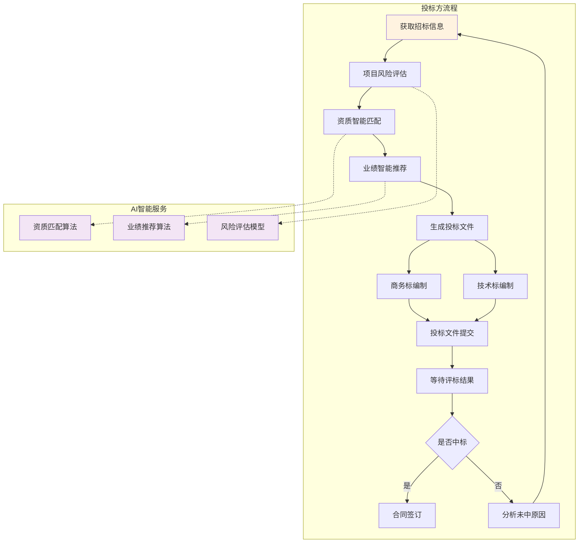

# 建筑招投标智能化平台 - 需求分析文档

## 一、项目背景

建筑招投标是建筑行业核心业务环节，传统模式存在以下痛点：

- 流程复杂，人工操作成本高
- 文档量大，信息整理耗时
- 标书编制重复性工作多
- 风险评估依赖经验
- 数据分散，难以分析利用

通过智能化平台，实现招投标全流程数字化、自动化、智能化，提升效率、降低风险、辅助决策。

---

## 二、业务流程图

---

## 三、核心功能模块

### 3.1 项目信息管理模块

**功能点：**
- 招标项目信息录入与管理
- 项目分类（住宅/商业/工业/基础设施等）
- 项目状态跟踪（招标中/投标中/评标中/已结束）
- 项目关联文档管理

**智能化特性：**
- 自动抓取公共招投标网站信息（待实现）
- 智能推荐匹配的投标项目
- 项目风险预警

---

### 3.2 投标文件智能编制模块

**功能点：**
- 投标文件模板库
- 商务标/技术标分类编辑
- 企业资质库管理
- 业绩案例库管理
- 团队人员库管理
- 施工方案模板库

**智能化特性：**
- 扫描件OCR识别，自动提取关键数据（待实现）
- AI自动匹配企业资质与项目要求
- 智能推荐相关业绩案例
- 价格智能分析与建议
- 格式合规性自动检查

---

### 3.3 招投标匹配与推荐模块

**功能点：**
- 企业能力画像
- 项目需求画像
- 能力-需求匹配度计算
- 推荐投标项目列表
- 匹配度可视化展示

**智能化特性：**
- 基于历史数据的智能匹配算法
- 多维度评分（资质、业绩、资金、地域等）
- 中标概率预测

---

### 3.4 风险评估模块

**功能点：**
- 项目风险识别
- 风险等级评定
- 风险因素分类（技术/财务/法律/管理）
- 风险应对建议
- 风险报告生成

**智能化特性：**
- 基于历史数据的风险预测模型
- 合同条款风险自动识别
- 付款条件风险分析
- 工期风险评估
- AI生成风险应对方案

---

### 3.5 数据分析中心模块

**功能点：**
- 招投标数据可视化仪表盘
- 中标率分析
- 投标成本分析
- 竞争对手分析
- 行业趋势分析

**智能化特性：**
- 自动生成洞察报告
- 趋势预测
- 异常数据检测

---

### 3.6 文档智能处理模块

**功能点：**
- 文档集中管理
- 文档分类与标签
- 全文检索
- 文档预览与编辑
- 批量操作

**智能化特性：**
- 图片/扫描件OCR文字识别
- 文档内容智能摘要
- 文档相似度检测
- 自动提取关键信息

---

### 3.7 用户权限管理模块

**功能点：**
- 多级用户角色（管理员/项目经理/投标专员/财务/法务）
- 权限精细控制
- 操作日志记录
- 数据权限隔离

---

### 3.8 审批流程模块

**功能点：**
- 多级审批工作流配置
- 审批节点定义（项目立项/投标提交/中标确认）
- 审批意见记录
- 审批历史追溯
- 审批通知与催办

---

## 四、技术架构

### 4.1 技术栈

**后端：**
- Django 5.x + Django REST Framework
- PostgreSQL（推荐）/ MySQL
- django-viewflow（审批工作流）
- Celery（异步任务）
- drf-spectacular（OpenAPI文档）

**前端（投标方前台）：**
- React 18 + TypeScript
- Vite（构建工具）
- Ant Design（UI组件库）
- Zustand（状态管理）
- TanStack Query（数据获取/缓存）
- React Router DOM（路由）
- Axios（HTTP客户端）

**AI能力（预留）：**
- 计算机视觉：百度OCR / 腾讯OCR API
- 自然语言处理：GPT API / 百度文心一言
- 匹配算法：规则引擎 + ML模型

**内部管理后台：**
- Django Admin（原生自带，Vibe Coding优化）

### 4.2 架构设计理念

**Vibe Coding 优先：**
- Django "约定优于配置" 模式，AI 生成代码准确率极高
- DRF 序列化器自动生成 OpenAPI 文档
- openapi-typescript 自动同步 TypeScript 类型定义
- Ant Design 组件固定，AI 生成完整业务页面质量高

**混合分工：**
| 职责 | 技术方案 | 理由 |
|------|----------|------|
| 内部管理+审批 | Django Admin | 模式固定，AI生成质量高 |
| 投标方前台 | React + Ant Design | 定制UI，客户体验好 |
| 数据API | DRF + OpenAPI | 前后端解耦，类型自动同步 |

### 4.3 部署方案

- Docker 容器化部署
- Nginx + Gunicorn（后端）
- 前端构建产物独立部署或集成 Django 静态目录

---

## 五、分阶段实施路线

### 第一阶段：投标方核心流程（3-4周）

**阶段目标：** 投标方视角完整闭环——项目浏览、投标提交、进度跟踪

**MVP范围：**
- [ ] 项目信息浏览与筛选（投标方视角）
- [ ] 投标文件在线提交
- [ ] 投标进度跟踪（待审批/审批中/已通过/已拒绝）
- [ ] 企业资质、业绩、人员基础数据管理
- [ ] 基础用户权限（投标专员、管理员角色）

**技术实现：**
- Django Admin：项目管理、投标记录管理、审批流程
- React 前台：项目列表、投标表单、进度查询

---

### 第二阶段：多级审批与智能推荐（3-4周）

**阶段目标：** 多级审批工作流、招投标智能匹配

- [ ] 多级审批流程配置（django-viewflow）
- [ ] 资质智能匹配算法
- [ ] 业绩智能推荐算法
- [ ] 项目风险评估基础模型
- [ ] 审批消息通知

---

### 第三阶段：AI能力集成（3-4周）

**阶段目标：** 智能化功能落地

- [ ] OCR智能识别集成（投标文件扫描件）
- [ ] AI自动填表
- [ ] 中标率预测模型
- [ ] 风险评估模型优化
- [ ] 文档智能摘要

---

### 第四阶段：移动端与数据分析（2-3周）

**阶段目标：** 移动端适配与数据洞察

- [ ] 移动端应用（UniApp + Vue 3 / React Native）
- [ ] 数据分析仪表盘完善
- [ ] 行业趋势分析
- [ ] 模型迭代优化

---

## 六、非功能性需求

### 6.1 性能要求
- 页面加载时间 < 2秒
- 支持并发用户数 > 100
- 大文件上传支持（>100MB）

### 6.2 安全要求
- 数据加密存储
- 操作日志审计
- 防SQL注入、XSS攻击
- JWT 认证

### 6.3 兼容性要求
- 支持 Chrome、Edge、Firefox 最新版本
- 响应式设计（桌面优先）

---

## 七、成功指标（KPI）

1. **效率提升**：投标文件编制时间缩短50%以上
2. **成本降低**：人工成本降低40%以上
3. **质量提升**：文档错误率降低80%
4. **中标率**：帮助客户提升中标率15-20%

---

*文档创建日期：2026-03-06*
*最后更新：2026-03-19*
*版本：v3.0（技术栈全面升级为 Django + React 混合架构）*
